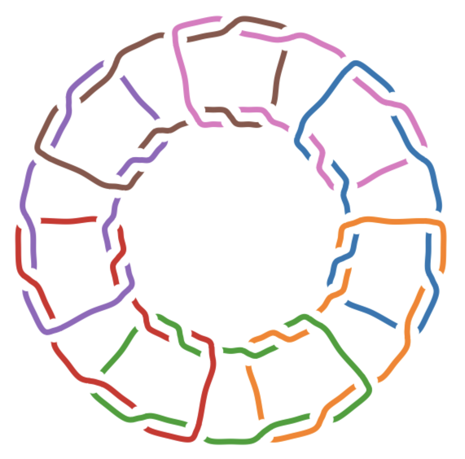
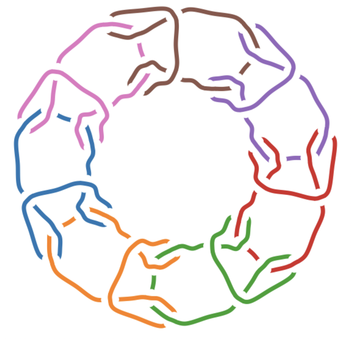
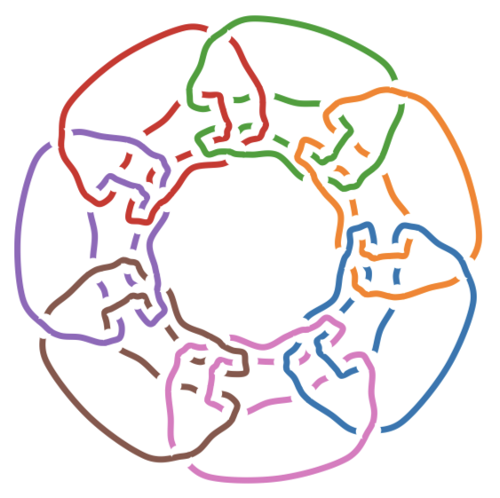
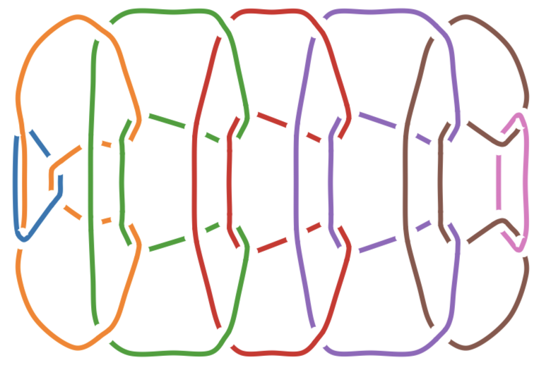

# Brunnian and Borromean Link Screening

This repository contains cleaned SnapPy scripts for determining Brunnian and
Borromean links and for checking candidate duplicate links.

## Get The Code

Clone the repository the first time you want a local copy:

```bash
git clone https://github.com/DiLiuLab/brunnian_scripts.git
cd brunnian_scripts
```

`git clone` downloads the repository and creates a local `brunnian_scripts`
folder. The `cd` command moves your terminal into that folder so you can run
the scripts.

If you already cloned the repository, update your local copy with:

```bash
git pull
```

`git pull` fetches the newest commits from GitHub and merges them into your
current local branch. Run it from inside the `brunnian_scripts` folder before
using the scripts if you want the latest README, examples, and results.

## Properties

A link is **Brunnian** if the full link is nontrivial, but removing any one
component gives an unlink. Equivalently, every proper sublink is trivial. The
classical example is the Borromean rings.

This repository uses the common convention that Brunnian links have at least 3
components. Some formal knot-theory definitions allow the n=2 case; under that
broader convention, a 2-component link is Brunnian if the full link is
nontrivial and each individual component is an unknot. For example, the Hopf
link can be Brunnian under the broad n=2-allowed convention, but not under the
n>=3 convention used here.

For the n>=3 convention, the code checks that the full link is nontrivial and
that every delete-one-component sublink is an unlink. Checking only delete-one
sublinks is sufficient: any smaller proper sublink is contained in one of those
delete-one sublinks, and a sublink of an unlink is also an unlink.

A link is treated as **Borromean** here if the full link is nontrivial and every
2-component sublink is an unlink. This includes the classical Borromean rings
and extends the same pairwise-unlinked condition to links with more than three
components. For n>3, this generalized Borromean condition is weaker than the
Brunnian condition, because a 3-component or larger proper sublink may still be
nontrivial even when every pair of components is unlinked.

The n=2 Brunnian edge case is not the same thing as being a 2-component prime
link. Under the broad n=2 convention, Brunnian means "nontrivial link with both
components unknotted." Prime means the link cannot be decomposed as a
nontrivial connected sum. These are different properties; for instance, Knot
Atlas describes `L10a108` as two interlinked trefoil knots, so its components
are not unknots.

## Illustrated Examples

The following examples are chosen from the generated screening files in
`Run_results/`. The diagrams are Knotscape images hosted by Knot Atlas, rather
than hand-drawn schematics.

`L6a4` appears in both `ht_screening_brunnian_nr.csv` and
`ht_screening_borromean_nr.csv` with `is_brunnian=True` and
`is_borromean=True`. It is the classical Borromean rings: the full 3-component
link is nontrivial, but deleting any one ring leaves a 2-component unlink.


Source: [Knot Atlas L6a4](https://katlas.org/wiki/L6a4).

`L10n107` appears in `ht_screening_borromean_nr.csv` with
`is_borromean=True` and `is_brunnian=False`. It is a 4-component example where
every 2-component sublink is an unlink, but at least one larger proper sublink
is still nontrivial. This illustrates why the generalized Borromean condition
is weaker than the Brunnian condition for links with more than 3 components.


Source: [Knot Atlas L10n107](https://katlas.org/wiki/L10n107).

## HT Table

The HT table is SnapPy's
[`HTLinkExteriors`](https://www.math.uic.edu/t3m/SnapPy/censuses.html#snappy.HTLinkExteriors)
census from the Hoste-Thistlethwaite link tables. It contains link exteriors
for links up to 14 crossings, together with data accessible through SnapPy such
as the link name, number of cusps/components, volume, triangulation
information, DT code, and solution type. The screening mode in this repository
iterates through this table by crossing number and filters to links with at
least 3 components.

## Master Scripts

- `determine_brunnian_borromean.py`
  - tests Brunnian links, Borromean links, or both
  - accepts a single `--link-string`, an `--input-file`, or `--screen-ht`
  - accepts SnapPy link names and quoted DT-code strings as link strings
  - supports `--method simplify` and `--method nr`
- `determine_duplicate_links.py`
  - checks candidate duplicate links by comparing non-geometric exteriors
  - accepts one group via `--links` or groups from `--input-file`
- `BL_DTv2_3.py` (current)
  - `V2_3` DT-code generator for **eight** link-construction families: the four
    Brunnian series, Edwards' Venn (`AM_n`), Brunn's classic (`BR_n`), the
    Fishtail bracelet, and the Mirror fishtail
  - accepts `--pattern` and `--n` in CLI mode; `--list-patterns` to enumerate
  - opens a Tkinter GUI when run without arguments or with `--gui`
  - defaults: n = 7 for the four original families, n = 5 for the rest
  - **V2_3 correction:** V2_2 and earlier emitted the *mirrored* stitch under
    the name `fishtail`. The true fishtail is the same-fold wrap, identified by
    the fact that its grip-span-1 reduction is the classical chain
    (= `cyclic_rubberband`); the mirrored rule fails that test. `fishtail` now
    emits the corrected code and the old code remains available as
    `mirror_fishtail` (aliases `v2_2_fishtail`, `twisted_fishtail`). The two
    share all 16 unsigned entries and differ in 8 signs; they are distinct
    links (n = 5 volumes 91.7463 vs 92.7683).
- `previous/`
  - earlier versions, including `BL_DTv2_1.py` and `BL_DTv2_2.py`, kept for
    reproducibility of previously generated output
  - this directory is listed in `.gitignore`, so it is a local archive rather
    than part of the repository; a fresh clone will not contain it

## Tightening Toward Ideal Form

Screening asks whether a diagram is Brunnian. This asks how short its rope can
be: ropelength = length / thickness, minimised with
[RidgeRunner](http://www.jasoncantarella.com/) and measured with `octrope`.

- `tighten_link_xyz.py`
  - the driver: `.xyz` to VECT conversion, runs RidgeRunner, dominance-based
    configuration selection, a degeneracy watcher, and a Tkinter GUI
  - `--symmetry`, `--symmetry-axis` and `--symmetry-ref` enforce a point group;
    the axis and reference options require a patched binary, see below
  - tees RidgeRunner's stdout into the run directory, where its `--Symmetry`
    warnings and symmetrisation error live — they do not appear in the `.rr` log
- `verify_topology.py`
  - HOMFLYPT comparison via plCurve's `knottype`, reporting an uncomputable
    polynomial as UNKNOWN rather than as a changed link
  - necessary and not sufficient: distinct links can share a polynomial, and
    every pairwise linking number of a Brunnian link is zero, so that check is
    vacuous here
- `symmetrize_link_xyz.py`
  - projects a link onto Cs, Ci, Cn or Cnv and writes a canonical frame —
    rotation axis on z, first mirror normal on x — matching the patched
    binary's `--SymmetryAxis` and `--SymmetryRef` defaults, so its output feeds
    RidgeRunner with no flags
- `sono_link_xyz.py`
  - independent SONO relaxer, allocation-grid sweeps, and adaptive coarsening
    with an in-run HOMFLY guard
- `tighten_cycle.py`
  - the **cycle driver**: automates contract/squeeze-then-recondition rounds, so
    a link can be taken from a raw layout to a tightened result unattended
  - `--choose-move` measures every geometric budget each round and picks between
    the hole squeeze and cluster contraction; `--find-axis` extends that to
    structures with no symmetry. `--auto-flags` sets RidgeRunner's own options
    from the measurements, `--auto-steps` stops each descent when reconditioning
    plateaus, `--vu-ladder` climbs the resolution ladder
  - HOMFLY-gates every round that needs it, symmetrises only when the measured
    deviation says it is safe, and writes `BEST.xyz` plus a per-round `ledger.csv`
  - `--resume` continues a cycle whose driver died. The round index, the running
    best and the ledger rows live only in the driver's memory until the cycle
    ends, so a crash loses all three while the per-round `.xyz` files survive;
    resume rebuilds the state from those files. It restarts at the first round
    that produced no output, and rebuilds the HOMFLY reference from round 0's
    input rather than from the resumed configuration — re-deriving it from where
    the run drifted to would adopt that drift as the new definition of
    "unchanged" — refusing to continue if the rebuilt reference disagrees with
    the recorded one. A descent cut off part-way is not resumed: its round is
    redone and the spent steps are reported rather than silently dropped
  - the descents are **reconditioning**, not polish: one bought +0.01 ropelength
    while restoring minRad/τ from 1.072 to 1.341 and the contact set from 785
    struts to 1260, and the next geometric move was only feasible because of it
- `tighten_lib/`
  - the geometric moves, symmetry tooling, resolution changes and diagnostics,
    each documented in `tighten_lib/README.md`
  - `compress_gap.py` is the axial gap squeeze and `radial_squeeze.py` the
    radial one — both monotone maps, hence homeomorphisms, hence the moves that
    *provably* cannot change the link. `contract_clusters.py` generalises to N
    clusters and is **not** monotone, so every round needs its own HOMFLY check
  - which move to use is a measurement, not a preference: the squeeze closes the
    void *enclosed* by a ring, the contraction the space *between* clusters.
    Screen both with the clearance bound — best-case `Rop = length/(minStrut/2)`
    ignoring minRad — and skip any move whose best case is already a loss
  - `refine_xyz.py --fix-minrad` is what makes refinement viable: MinRad scales
    with edge length, so plain subdivision divides it by the refinement factor
    and inflates ropelength
  - `strut_free.py` decides whether `--Timewarp` is worth its cost;
    `extract_best.py` recovers both the lowest-ropelength and the most nearly
    critical snapshot, which diverge
- `ridgerunner_patches/`
  - a diff against RidgeRunner 2.3.1 adding `Ci`, `Cs`, `Cpv` and `RDp` plus an
    explicit symmetry axis and reference direction, a build script that installs
    beside the stock binary rather than over it, and the caveats
  - note that RidgeRunner's own `--Symmetry=D2` builds a **single mirror** —
    `Cs`, order 2 — and not the D2 of molecular symmetry; `RD2` is the real one
  - `--Symmetry` forces `--AnimationStepper` and changes the equilateralisation
    regime, so a constrained arm cannot be compared against an ordinary one
    without a control that passes `--AnimationStepper` too

## Examples

See `Examples/README.md` for runnable examples and input files.

Single link:

```bash
python3 determine_brunnian_borromean.py --link-string L14n63195 --property both --method nr
```

Single DT code:

```bash
python3 determine_brunnian_borromean.py --link-string "DT: [(-8,-12,16),(-24,-22,-28,-26),(-10,-14,-2),(-20,-6,-18,-4)]" --property brunnian --method nr
```

Five-component DT-code example that is both Brunnian and Borromean:

```bash
python3 determine_brunnian_borromean.py --link-string "DT: [(32,18,20,22,24,26,28,30),(34,52,36,54,40,50,42,58),(2,46,6,10,48,14),(4,56,12,60),(-38,8,16,-44)]" --property both --method nr
```

Expected output:

```text
DT: [(32,18,20,22,24,26,28,30),(34,52,36,54,40,50,42,58),(2,46,6,10,48,14),(4,56,12,60),(-38,8,16,-44)]: Brunnian=True, Borromean=True
```

HT screening:

```bash
python3 determine_brunnian_borromean.py --screen-ht --property both --method nr --only-matches --output Run_results/ht_screening_brunnian_borromean_nr.csv
```

Duplicate-link check from command-line link strings:

```bash
python3 determine_duplicate_links.py --links L14n49573 L14n50824
```

Duplicate-link check from command-line DT-code strings. Quote each DT code so
the shell passes it as one argument:

```bash
python3 determine_duplicate_links.py --links "DT: [(-8,-12,16),(-24,-22,-28,-26),(-10,-14,-2),(-20,-6,-18,-4)]" "DT: [(-6,16),(26,-2,34,32,-40,-30,4,38,-28,-36),(-8,-22,18,12),(10,-24,20,-14)]"
```

Duplicate-link check from an input file. In the file, use one link string per
line and blank lines to separate independent candidate groups:

```bash
python3 determine_duplicate_links.py --input-file Examples/duplicate_candidate_groups.txt
```

Duplicate-link check with CSV output:

```bash
python3 determine_duplicate_links.py --input-file Examples/duplicate_candidate_groups.txt --output Run_results/duplicate_candidate_groups.csv
```

Generate a DT code from one of the four construction families:

```bash
python3 BL_DTv2_3.py --pattern cyclic_larks --n 7
```

Generate the corrected fishtail code (and the mirrored variant):

```bash
python3 BL_DTv2_3.py --pattern fishtail --n 5
python3 BL_DTv2_3.py --pattern mirror_fishtail --n 5
```

Open the GUI:

```bash
python3 BL_DTv2_3.py
```

List accepted canonical pattern names:

```bash
python3 BL_DTv2_3.py --list-patterns
```

## BL_DT Pattern Snapshots

The GUI shows an example snapshot from `Assets/` for the selected pattern:
7 components for the four original Brunnian families, 5 for the four added
later. `cyclic larks.png` is also used as the Tkinter app icon when the
platform supports PNG window icons. The script still runs if these image files
are missing.

**Note (July 2026):** `Assets/fishtail.png` previously showed the *mirrored*
stitch, matching the V2_2 code. It now shows the true fishtail, and the old
figure is kept as `Assets/mirror fishtail.png` for the `mirror_fishtail`
pattern.

The figures were prepared with the `draw_dt_original_labels` tool in
[DiLiuLab/dt_strand_passage_explorer](https://github.com/DiLiuLab/dt_strand_passage_explorer).

| Pattern | Snapshot |
| --- | --- |
| Cyclic squares |  |
| Cyclic larks |  |
| Cyclic rubberband |  |
| Linear rubberband |  |

Snapshots for the four families added in V2_2/V2_3 live in `Assets/` as
`Edward.png` (Edwards' Venn), `Brunn.png` (Brunn's classic), `fishtail.png`
(the true fishtail) and `mirror fishtail.png` (the mirrored variant); they are
not reproduced in this table.

## Screening Results

`Run_results/` includes HT-table screening outputs for crossings 3 through 14:

- `ht_screening_brunnian_simplify.csv`: 53 Brunnian matches
- `ht_screening_borromean_simplify.csv`: 65 Borromean matches
- `ht_screening_brunnian_borromean_simplify.csv`: combined simplify output
- `ht_screening_brunnian_nr.csv`: 53 Brunnian matches
- `ht_screening_borromean_nr.csv`: 65 Borromean matches
- `ht_screening_brunnian_borromean_nr.csv`: combined nR output

For this range, the `simplify` and `nr` methods produced identical link-name
sets for both Brunnian and Borromean screening.

The `mark` column preserves the original quick duplicate-candidate grouping:
matching stars (`*`, `**`, etc.) indicate rows with the same component count,
crossing number, and rounded volume. Use `determine_duplicate_links.py` for the
stronger exterior-isomorphism check.

## References

- H. N. Howards, [Brunnian Spheres](https://users.wfu.edu/howards/papers/brunnianspheres.pdf).
- B. S. Mangum and T. Stanford, [Brunnian links are determined by their complements](https://eudml.org/doc/121302), Algebraic & Geometric Topology 1, 143-152, 2001.
- C. Liang and K. Mislow, [On Borromean links](https://webhomes.maths.ed.ac.uk/~v1ranick/papers/liangmislow.pdf), Journal of Mathematical Chemistry 16, 27-35, 1994.
- Knot Atlas, [L10a108 Quick Notes](https://katlas.org/wiki/L10a108_Quick_Notes).
