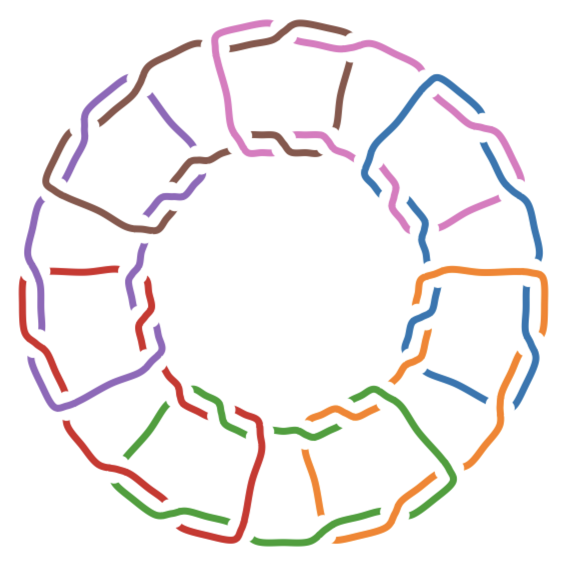
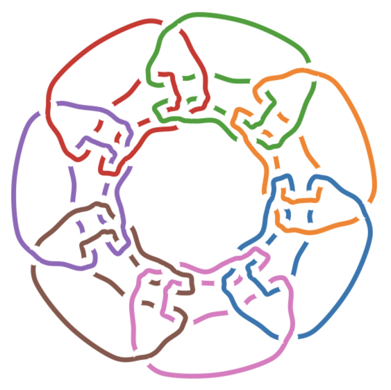
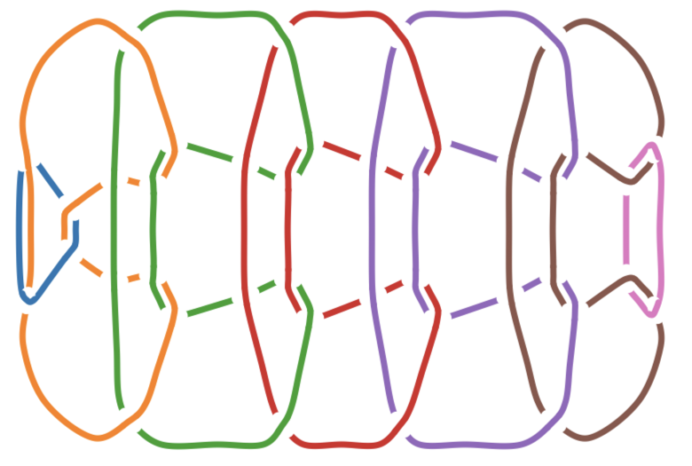

# Brunnian and Borromean Link Screening

This repository contains cleaned SnapPy scripts for determining Brunnian and
Borromean links and for checking candidate duplicate links.

## Get The Code

Clone the repository the first time you want a local copy:

```bash
git clone https://github.com/DiLiuLab/brunnian_scripts.git
cd brunnian_scripts
```

`git clone` downloads the repository and creates a local `brunnian_scripts`
folder. The `cd` command moves your terminal into that folder so you can run
the scripts.

If you already cloned the repository, update your local copy with:

```bash
git pull
```

`git pull` fetches the newest commits from GitHub and merges them into your
current local branch. Run it from inside the `brunnian_scripts` folder before
using the scripts if you want the latest README, examples, and results.

## Properties

A link is **Brunnian** if the full link is nontrivial, but removing any one
component gives an unlink. Equivalently, every proper sublink is trivial. The
classical example is the Borromean rings.

This repository uses the common convention that Brunnian links have at least 3
components. Some formal knot-theory definitions allow the n=2 case; under that
broader convention, a 2-component link is Brunnian if the full link is
nontrivial and each individual component is an unknot. For example, the Hopf
link can be Brunnian under the broad n=2-allowed convention, but not under the
n>=3 convention used here.

For the n>=3 convention, the code checks that the full link is nontrivial and
that every delete-one-component sublink is an unlink. Checking only delete-one
sublinks is sufficient: any smaller proper sublink is contained in one of those
delete-one sublinks, and a sublink of an unlink is also an unlink.

A link is treated as **Borromean** here if the full link is nontrivial and every
2-component sublink is an unlink. This includes the classical Borromean rings
and extends the same pairwise-unlinked condition to links with more than three
components. For n>3, this generalized Borromean condition is weaker than the
Brunnian condition, because a 3-component or larger proper sublink may still be
nontrivial even when every pair of components is unlinked.

The n=2 Brunnian edge case is not the same thing as being a 2-component prime
link. Under the broad n=2 convention, Brunnian means "nontrivial link with both
components unknotted." Prime means the link cannot be decomposed as a
nontrivial connected sum. These are different properties; for instance, Knot
Atlas describes `L10a108` as two interlinked trefoil knots, so its components
are not unknots.

## Illustrated Examples

The following examples are chosen from the generated screening files in
`Run_results/`. The diagrams are Knotscape images hosted by Knot Atlas, rather
than hand-drawn schematics.

`L6a4` appears in both `ht_screening_brunnian_nr.csv` and
`ht_screening_borromean_nr.csv` with `is_brunnian=True` and
`is_borromean=True`. It is the classical Borromean rings: the full 3-component
link is nontrivial, but deleting any one ring leaves a 2-component unlink.


Source: [Knot Atlas L6a4](https://katlas.org/wiki/L6a4).

`L10n107` appears in `ht_screening_borromean_nr.csv` with
`is_borromean=True` and `is_brunnian=False`. It is a 4-component example where
every 2-component sublink is an unlink, but at least one larger proper sublink
is still nontrivial. This illustrates why the generalized Borromean condition
is weaker than the Brunnian condition for links with more than 3 components.


Source: [Knot Atlas L10n107](https://katlas.org/wiki/L10n107).

## HT Table

The HT table is SnapPy's
[`HTLinkExteriors`](https://www.math.uic.edu/t3m/SnapPy/censuses.html#snappy.HTLinkExteriors)
census from the Hoste-Thistlethwaite link tables. It contains link exteriors
for links up to 14 crossings, together with data accessible through SnapPy such
as the link name, number of cusps/components, volume, triangulation
information, DT code, and solution type. The screening mode in this repository
iterates through this table by crossing number and filters to links with at
least 3 components.

## Master Scripts

- `determine_brunnian_borromean.py`
  - tests Brunnian links, Borromean links, or both
  - accepts a single `--link-string`, an `--input-file`, or `--screen-ht`
  - accepts SnapPy link names and quoted DT-code strings as link strings
  - supports `--method simplify` and `--method nr`
- `determine_duplicate_links.py`
  - checks candidate duplicate links by comparing non-geometric exteriors
  - accepts one group via `--links` or groups from `--input-file`
- `BL_DTv2_4.py` (current)
  - `V2_4` DT-code and Jones-polynomial generator for **eight**
    link-construction families: the four Brunnian series, Edwards' Venn
    (`AM_n`), Brunn's classic (`BR_n`), the Fishtail bracelet, and the Mirror
    fishtail
  - accepts `--pattern` and `--n` in CLI mode; `--list-patterns` to enumerate
  - opens a Tkinter GUI when run without arguments or with `--gui`
  - defaults: n = 7 for the four original families, n = 5 for the rest
  - **V2_4: Jones polynomials.** Every pattern now also prints V(t), and V(q)
    with t = q^2, for the chosen n. They are computed exactly in plain Python
    (no SnapPy or Sage), from the DT code plus a closed sign rule per family,
    so the method is described in each family's formula text. See
    [Jones polynomials](#jones-polynomials) below.
  - **V2_4: preview images.** In V2_3 the Edwards' Venn and Brunn's classic
    snapshots were swapped. They are now the `BL_series_2D` drawings of AM_5
    and BR_5 (see [BL_DT Pattern Snapshots](#bl_dt-pattern-snapshots)).
  - **V2_4: braid sign convention, reworded.** V2_3 described the Edwards'
    Venn and Brunn's classic codes as "an even label is positive iff its pass
    is an over-pass", with s_i taking the lower strand over. That is the
    opposite of how SnapPy, KnotTheory and `dt_strand_passage` read a DT
    code. The text now says what those readers see: a negative even label
    marks an over-pass, and s_i takes the strand in position i under the one
    in position i+1. The codes themselves are unchanged.
  - **V2_3 correction:** V2_2 and earlier emitted the *mirrored* stitch under
    the name `fishtail`. The true fishtail is the same-fold wrap, identified by
    the fact that its grip-span-1 reduction is the classical chain
    (= `cyclic_rubberband`); the mirrored rule fails that test. `fishtail` now
    emits the corrected code and the old code remains available as
    `mirror_fishtail` (aliases `v2_2_fishtail`, `twisted_fishtail`). The two
    share all 16 unsigned entries and differ in 8 signs; they are distinct
    links (n = 5 volumes 91.7463 vs 92.7683).
- `previous/`
  - earlier versions, including `BL_DTv2_1.py`, `BL_DTv2_2.py` and
    `BL_DTv2_3.py`, kept for reproducibility of previously generated output
  - this directory is listed in `.gitignore`, so it is a local archive rather
    than part of the repository; a fresh clone will not contain it

## Tightening Toward Ideal Form

Screening asks whether a diagram is Brunnian. This asks how short its rope can
be: ropelength = length / thickness, minimised with
[RidgeRunner](http://www.jasoncantarella.com/) and measured with `octrope`.

- `tighten_link_xyz.py`
  - the driver: `.xyz` to VECT conversion, runs RidgeRunner, dominance-based
    configuration selection, a degeneracy watcher, and a Tkinter GUI
  - `--symmetry`, `--symmetry-axis` and `--symmetry-ref` enforce a point group;
    the axis and reference options require a patched binary, see below
  - tees RidgeRunner's stdout into the run directory, where its `--Symmetry`
    warnings and symmetrisation error live — they do not appear in the `.rr` log
- `verify_topology.py`
  - HOMFLYPT comparison via plCurve's `knottype`, reporting an uncomputable
    polynomial as UNKNOWN rather than as a changed link
  - necessary and not sufficient: distinct links can share a polynomial, and
    every pairwise linking number of a Brunnian link is zero, so that check is
    vacuous here
- `symmetrize_link_xyz.py`
  - projects a link onto Cs, Ci, Cn or Cnv and writes a canonical frame —
    rotation axis on z, first mirror normal on x — matching the patched
    binary's `--SymmetryAxis` and `--SymmetryRef` defaults, so its output feeds
    RidgeRunner with no flags
- `sono_link_xyz.py`
  - independent SONO relaxer, allocation-grid sweeps, and adaptive coarsening
    with an in-run HOMFLY guard
- `tighten_gui.py`
  - a tkinter window for `tighten_cycle.py`, entered by running it with **no
    arguments** or with `--gui`. Every label, default, type and help string is
    read out of the argument parser at run time, so nothing is duplicated: add
    an argument to `build_parser()` and it appears in the window, in its own
    group, with the right widget
  - each field carries a light-blue **?** that opens its own help text, its
    default, and — where one earns its place — a worked example
  - it is a **launcher, not a host**. A cycle runs for hours, so *Run in
    background* spawns a detached process logging to `<work-dir>/cycle.log` and
    hands back the command to watch it; closing the window does not stop the
    job. *Build command* just shows the command line, which is also the way to
    learn the CLI
  - the values are validated by argparse itself before anything is launched, so
    the window cannot assemble a command the script would reject
- `tighten_cycle.py`
  - the **cycle driver**: automates contract/squeeze-then-recondition rounds, so
    a link can be taken from a raw layout to a tightened result unattended
  - `--choose-move` measures every geometric budget each round and picks between
    the hole squeeze and cluster contraction; `--find-axis` extends that to
    structures with no symmetry. `--auto-flags` sets RidgeRunner's own options
    from the measurements, `--auto-steps` stops each descent when reconditioning
    **and ropelength** have both plateaued, `--vu-ladder` climbs the resolution
    ladder
  - HOMFLY-gates every round that needs it, symmetrises only when the measured
    deviation says it is safe, and writes `BEST.xyz` plus a per-round `ledger.csv`
  - `--resume` continues a cycle whose driver died. The round index, the running
    best and the ledger rows live only in the driver's memory until the cycle
    ends, so a crash loses all three while the per-round `.xyz` files survive;
    resume rebuilds the state from those files. It restarts at the first round
    that produced no output, and rebuilds the HOMFLY reference from round 0's
    input rather than from the resumed configuration — re-deriving it from where
    the run drifted to would adopt that drift as the new definition of
    "unchanged" — refusing to continue if the rebuilt reference disagrees with
    the recorded one. A descent cut off part-way is not resumed: its round is
    redone and the spent steps are reported rather than silently dropped
  - the descents are **reconditioning**, not polish: one bought +0.01 ropelength
    while restoring minRad/τ from 1.072 to 1.341 and the contact set from 785
    struts to 1260, and the next geometric move was only feasible because of it
  - but a repaired thickness is **not** a converged ropelength, and `--auto-steps`
    originally stopped on minRad and struts alone. On the 7-component link that
    ended a round at step 12 000 with ropelength 276.080; restarting that exact
    file with *no geometric move at all* recovered 0.84 units in 8 500 steps and
    was still falling. Replayed against the traces, the old rule would also have
    stopped a converged 5-component run at step 10 000 and lost 0.34 units. The
    stop now needs ropelength flat as well — `--rop-eps`, default 1e-4 per block,
    against ~4e-4 for a descent still working and under 1e-5 for a converged one
  - `--plateau-on` chooses which of the three signals gate the stop; the default
    `auto` keys on the round's own move. A squeeze at `f <= --plateau-hard-f`
    (0.5; smaller f is *more* aggressive) is a repair round whose output feeds
    another move, so it gates on minRad and struts only rather than polishing a
    configuration about to be broken again. Gentler squeezes, contractions and
    initial descents gate on all three. Truncation **propagates** — 7BL round 1
    stopping early meant round 2 began from a less converged input — so run any
    round you will report with the full gate
  - `--slp final` (opt-in; the default is `off`) ends the cycle with the
    equivariant SLP polish (`tighten_lib/slp_tighten.py`, below) on the best
    normalised file, in the group the run used unless `--slp-group` says
    otherwise. The defaults run one pass with no resample; for the 8BL recipe
    add `--slp-passes 2 --slp-resample-vu 6`. Alternatively, `--slp plateau`
    polishes after each round's descent (not the initial descent) of a
    symmetric run that leaves the residual above `--slp-trigger-residual`
    (0.1) with more than 200 struts; it does not also run the final polish,
    and the next round still continues from the descended file unless
    `--slp-carry` is given. Either way the result is kept only on HOMFLY SAME
    and a gain of more than `--slp-min-gain` (0.05), and is recorded as
    link-gated, not diagram-checked. `--slp-arg` passes further flags to the
    tool, but not `--elo`, `--ehi` or `--allow-edge-collapse`: the stage's
    collapse guard is measured against the default edge bounds
- `tighten_lib/`
  - the geometric moves, symmetry tooling, resolution changes and diagnostics,
    each documented in `tighten_lib/README.md`
  - `compress_gap.py` is the axial gap squeeze and `radial_squeeze.py` the
    radial one — both monotone maps, hence homeomorphisms, hence the moves that
    *provably* cannot change the link. `contract_clusters.py` generalises to N
    clusters and is **not** monotone, so every round needs its own HOMFLY check
  - which move to use is a measurement, not a preference: the squeeze closes the
    void *enclosed* by a ring, the contraction the space *between* clusters.
    Screen both with the clearance bound — best-case `Rop = length/(minStrut/2)`
    ignoring minRad — and skip any move whose best case is already a loss
  - the squeeze go/no-go is **marginal sensitivity**: `(Δτ/τ)/(ΔL/L)` for an
    *infinitesimal* squeeze (probe f=0.99), i.e. the thickness destroyed by the
    first nudge inward. It separates a hole held open by SLACK from one held
    open by the PACKING of the strands around it — a distinction an open hole
    cannot make, and the reason "there is a tunnel" was never a budget. Every
    squeeze that won measured ≤ 2.04, every one that lost ≥ 2.57, and the gate
    refuses above `--squeeze-max-sens` (2.30). The same quantity measured at
    the factor the sweep would pick reads 2.99 for a winner and 3.03 for a
    loser: the signal exists only in the limit
  - for a squeeze, also read the **sensitivity** column that `scan_squeeze` prints:
    `sens = (Δτ/τ)/(ΔL/L)`, the thickness destroyed per unit of length removed.
    An open hole is not by itself a budget — the question is whether the hole is
    held open by slack or by the packing of the strands around it, and only
    sensitivity can tell them apart. The admissibility margin cannot: it is a
    ratio, so a squeeze that crushes minRad and minStrut together passes it, and
    it is not monotone in the factor, so it rejects gentle squeezes and admits
    violent ones. Measured across this project, squeezes at sens 1.75–3.17 all
    won and the one at 4.08 lost twice. The column is reported, not enforced
  - `refine_xyz.py --fix-minrad` is what makes refinement viable: MinRad scales
    with edge length, so plain subdivision divides it by the refinement factor.
    The cycle now refines with **both** modes and keeps whichever leaves the
    better corner margin — neither is reliably better (on one file subdivide
    ranged over minRad 0.33–0.61 and spline 0.45–0.52, the winner flipping by
    target), and the margin is what the next move spends. `--refine-mode-fixed`
    restores the single-mode behaviour
  - `measure_link.py` reports the same squeeze verdict the driver applies. It
    used to advertise "there is room for a hole squeeze" from the wall radius
    alone, which recommended squeezing a structure the driver refuses
    and inflates ropelength
  - `strut_free.py` decides whether `--Timewarp` is worth its cost;
    `extract_best.py` recovers both the lowest-ropelength and the most nearly
    critical snapshot, which diverge
- `tighten_lib/slp_tighten.py`
  - the **equivariant sequential-LP polish**: per-vertex displacements
    restricted to the exact symmetry subspace (C1, Cs, Ci, Cn, Cnv, Cnh, RDn,
    Dnd, S2n, via `tighten_lib/symmetry_maps.py`). Each LP minimises length
    subject to linearised no-approach constraints on near pairs, both Rawdon
    minRad branches >= tau, and edge-length bounds, inside a trust region, and
    the step is projected back onto the exact symmetry. A step is accepted only
    if octrope's ropelength falls AND a PL isotopy certificate proves the
    straight-line step stays embedded
  - why it exists: `--Symmetry` forces the Animation stepper, which "won't
    converge to low residual", so a symmetric run can park well above
    residual 0.1. The 8BL RD2 legs ended at 0.31-0.43, the 7BL (C7) best at
    0.322 and the lark (C5) best at 0.263, and on all three the floor was the
    stepper's, not the configuration's: the SLP lowered ropelength and
    residual together. It is not universal: 4BL_wider under C2v stopped on its
    residual criterion at 0.0146, so the trigger is a measurement
    (residual > 0.1, or `--diagnose`), not the presence of `--Symmetry`
  - on 8BL D2d, after every geometric move had returned nothing or lost, the
    hand-run slp_B chain (the campaign's own scripts, run step by step) took
    298.242 -> 291.748, residual 0.307 -> 0.010. That file is the one with a
    diagram check
  - this tool, as shipped (link-gated: HOMFLY SAME, exact symmetry,
    cert_rejects 0):
    - the 8BL recipe, `--group D2d --passes 2 --resample-vu 6`: 298.242 ->
      291.745 in 618 s, residual 0.005, 2486 struts
    - one pass, the default: 7BL (C7) 274.365 -> 272.816 (residual 0.322 ->
      0.147; it stopped at `--dmin` after 664 s of a 15-minute budget), lark
      (C5) 210.041 -> 202.282 (0.263 -> 0.136; stopped on the 15-minute
      budget) and 4_LC (Cs) 113.590 -> 113.049 (0.259 -> 0.141; 4-minute
      budget)
  - the designer's prototype (`slp_generic_probe_v2.py`, the code this tool
    was built from) reached 7BL 273.910, lark 204.141 and 4_LC (Cs) 113.036.
    Its 7BL run stopped at `--dmin` after 119 s, probably on the defect the
    tool now avoids: once an accepted step had dipped the thickness, the rows
    still asked for the pass's starting thickness, the LP went infeasible and
    the trust region shrank to nothing. A pass now rebuilds the rows at the
    iterate's own thickness when that happens (`floor_rebuilds` in the
    `SLP RESULT` line: 0 on 8BL, 13 on 7BL, 3 on lark)
  - below a residual of about 0.1 it buys almost nothing (4BL_wider, C2v:
    112.194 -> 112.1905); use the default-stepper `--no-eq` polish there
  - edge bounds are **not optional**: without them an end-ring edge collapsed
    (ratio 125, rop 297.035) and HOMFLY still said SAME. They are on by
    default, 0.8-1.25 of each component's mean edge, and only
    `--allow-edge-collapse` turns them off (and the cycle's `--slp-arg` will
    not pass it)
  - it changes geometry and does not check topology, so gate its output:
    `--gate-ref REF` exits 4 unless HOMFLY is SAME in the cycle's generic
    frame, and `tighten_cycle.py --slp final` replaces `BEST.xyz` only on
    HOMFLY SAME and a gain of more than `--slp-min-gain` (0.05)
  - the gate is on the **link, not the diagram**: HOMFLY cannot see a diagram,
    so the diagram may change. Check it with a diagram-isomorphism tool before
    quoting a per-diagram minimum. The drops on the 5BL lark (C5; 202.282 is
    below the 205.44 file that crossed into the square basin and 0.12 above
    5BL_square's 202.158), 4_LC, 2_BC and 7BL are findings that still need
    that check
  - its output is often curvature-active (minRad = minStrut/2 = tau: 8BL,
    4_LC, and 7BL after its full run), but not always (lark ends at
    minRad/tau 1.034, and 7BL after the cycle's 2-minute stage at 1.108).
    Either way do not re-descend it: on 8BL every ridgerunner restart cost
    +0.36 to +0.38 at once. `measure_link.py` reads a curvature-active file
    with more than 200 struts as "contact AND curvature both active" at any
    residual, calls it converged below residual 0.1, and above that advises
    another SLP pass rather than a descent; a contact-limited output such as
    lark's still gets the old "room to descend" wording
  - `--diagnose` prints the first-order feasible fraction of the length
    gradient (13.7% on 8BL at 298.242; about 0 means critical), and
    `--group detect` lists which of its 38 candidate groups the file holds
    exactly, in the canonical frame (axis z, reference x) unless `--axis` and
    `--ref` say otherwise
- `ridgerunner_patches/`
  - a diff against RidgeRunner 2.3.1 adding `Ci`, `Cs`, `Cpv` and `RDp` plus an
    explicit symmetry axis and reference direction, a build script that installs
    beside the stock binary rather than over it, and the caveats
  - note that RidgeRunner's own `--Symmetry=D2` builds a **single mirror** —
    `Cs`, order 2 — and not the D2 of molecular symmetry; `RD2` is the real one
  - `--Symmetry` forces `--AnimationStepper` and changes the equilateralisation
    regime, so a constrained arm cannot be compared against an ordinary one
    without a control that passes `--AnimationStepper` too
  - the same stepper "won't converge to low residual", by its own help. A
    symmetric run can park well above residual 0.1 (8BL RD2 legs 0.31-0.43,
    7BL C7 0.322, lark C5 0.263), and there the floor was the stepper's, not
    the configuration's; `tighten_lib/slp_tighten.py` is the polish for it.
    Not every symmetric run parks: 4BL_wider under C2v stopped on its
    residual criterion at 0.0146

**Deferred, not in the SLP change (2026-10-05):**

- `choose_rr_flags` in `tighten_cycle.py` does not know about `--symmetry`.
  It selects `--eq` whenever the residual is above 0.1, ridgerunner turns
  EqOn off under `--Symmetry`, and the stepper often keeps the residual
  above 0.1, so under a symmetry the `--eq` it selects never runs (only its
  `--Timewarp` does)
- `_build_descend_cmd` passes `--symmetry` to `tighten_link_xyz.py` but not
  `--ridgerunner`, `--symmetry-axis`, `--symmetry-ref` or `--decimals`. The
  cycle therefore cannot run a non-default frame (8BL's RD2 legs needed
  `--SymmetryRef=1,1,0`), and its descents are written at the driver's default
  9 decimals
- the D2d symmetrizer's continuous mode, which projects a raw drawing whose
  vertices do not correspond, stays in the 8BL D2d campaign's
  `tools/d2d_symmetrize.py`, outside this repository. `symmetry_maps.py`
  handles only files that are already vertex-exact; `slp_tighten.py` will
  project a file that is within 0.05 mean edges of exact, once
- also not done: replacing the Cn-only `symmetry_deviation` with
  `symmetry_maps`, and a diagram-basin gate (the 8BL `final_diagram_check.py`
  assumes a fixed 48-crossing target and raw reference)

Done in the same change: `measure()` in `tighten_cycle.py`, which
`measure_link.py` also uses, now writes its scratch `.vect` into a temporary
directory and runs octrope's `ropelength`, `struts` and `residual` there. Until
2026-10-05 both scripts ran `residual` in the current directory, which dropped
its A.dat/A.mat dumps (246 MB each for a 1748-vertex file) wherever they were
started, the repository included. `extract_best.py` and `strut_free.py` still
call `residual` without a temporary cwd, so run those from a work directory.

## Examples

See `Examples/README.md` for runnable examples and input files.

Single link:

```bash
python3 determine_brunnian_borromean.py --link-string L14n63195 --property both --method nr
```

Single DT code:

```bash
python3 determine_brunnian_borromean.py --link-string "DT: [(-8,-12,16),(-24,-22,-28,-26),(-10,-14,-2),(-20,-6,-18,-4)]" --property brunnian --method nr
```

Five-component DT-code example that is both Brunnian and Borromean:

```bash
python3 determine_brunnian_borromean.py --link-string "DT: [(32,18,20,22,24,26,28,30),(34,52,36,54,40,50,42,58),(2,46,6,10,48,14),(4,56,12,60),(-38,8,16,-44)]" --property both --method nr
```

Expected output:

```text
DT: [(32,18,20,22,24,26,28,30),(34,52,36,54,40,50,42,58),(2,46,6,10,48,14),(4,56,12,60),(-38,8,16,-44)]: Brunnian=True, Borromean=True
```

HT screening:

```bash
python3 determine_brunnian_borromean.py --screen-ht --property both --method nr --only-matches --output Run_results/ht_screening_brunnian_borromean_nr.csv
```

Duplicate-link check from command-line link strings:

```bash
python3 determine_duplicate_links.py --links L14n49573 L14n50824
```

Duplicate-link check from command-line DT-code strings. Quote each DT code so
the shell passes it as one argument:

```bash
python3 determine_duplicate_links.py --links "DT: [(-8,-12,16),(-24,-22,-28,-26),(-10,-14,-2),(-20,-6,-18,-4)]" "DT: [(-6,16),(26,-2,34,32,-40,-30,4,38,-28,-36),(-8,-22,18,12),(10,-24,20,-14)]"
```

Duplicate-link check from an input file. In the file, use one link string per
line and blank lines to separate independent candidate groups:

```bash
python3 determine_duplicate_links.py --input-file Examples/duplicate_candidate_groups.txt
```

Duplicate-link check with CSV output:

```bash
python3 determine_duplicate_links.py --input-file Examples/duplicate_candidate_groups.txt --output Run_results/duplicate_candidate_groups.csv
```

Generate a DT code and its Jones polynomial from one of the four construction
families:

```bash
python3 BL_DTv2_4.py --pattern cyclic_larks --n 7
```

Generate the corrected fishtail code (and the mirrored variant):

```bash
python3 BL_DTv2_4.py --pattern fishtail --n 5
python3 BL_DTv2_4.py --pattern mirror_fishtail --n 5
```

Skip the Jones polynomial, or compute it above the default n limit:

```bash
python3 BL_DTv2_4.py --pattern brunn_classic --n 9 --no-jones
python3 BL_DTv2_4.py --pattern brunn_classic --n 9 --force-jones
```

Open the GUI:

```bash
python3 BL_DTv2_4.py
```

List accepted canonical pattern names:

```bash
python3 BL_DTv2_4.py --list-patterns
```

## Jones polynomials

`BL_DTv2_4.py` prints the Jones polynomial of the emitted DT code, written as
both V(t) and V(q) with t = q^2. Every result is checked against
V(1) = (-2)^(n-1).

- **Method.** A Kauffman-bracket state sum, contracted one crossing at a time
  while keeping only how the open edges pair up, then
  V = (-A^3)^(-w) <D> with A = t^(-1/4). The right-handed trefoil has
  V = t + t^3 - t^4. The bracket needs only the Gauss pairing and the
  crossing signs, because the A-smoothing is the oriented smoothing at a
  positive crossing and the unoriented one at a negative crossing. The signs
  are the only planar input, and each family has a closed rule for them:
  - Cyclic families (squares, larks, rubberband, both fishtails): every
    crossing has the same handedness, so the crossing at DT entry a_i has
    sign sgn(a_i)·sgn(a_1).
  - `AM_n` and `BR_n`: the sign of the crossing's braid letter, normalized
    by the letter at label 1.
  - Linear rubberband: a short per-component pattern, printed in the formula
    text.

  These rules match SnapPy's realization of the code for n = 3..20, and
  n = 3..8 for the braid families.
- **Mirror convention.** A DT code fixes a link only up to mirror image. The
  polynomial printed is that of the link SnapPy/spherogram builds from the
  code: a negative even entry marks an even over-pass, and crossing 1 is
  positive. This is the same choice `dt_converter.py --polynomials` makes in
  `dt_strand_passage`, and the mirror image has V(1/t). The choice only
  matters for the Mirror fishtail, whose V(t) is not palindromic (it is
  chiral). Every other family's V(t) is palindromic over the computed range.
- **Verification.** The 24 polynomials in `../BL_series_2D/BL_scripts`
  (`BL_list.xlsx`; n = 3..6 for six families, from transfer-matrix and Sage
  braid computations) are reproduced exactly. Both fishtails at n = 3 match
  `dt_converter.py` term for term.
- **Observed identities** (not proofs):
  - Cyclic larks and cyclic squares have the same V(t) for n = 3..40.
  - `AM_n` and `BR_n` have the same V(t) for n = 3..8, consistent with their
    shared isometry signature at n = 5.
- **Cost and default limits.** The linear families cost roughly linearly in n
  (cyclic rubberband n = 40 in 0.7 s). The braid families follow the braid
  word, so the frontier holds Catalan(n) states: AM_8 took 6.5 s and BR_8
  22 s. The fishtail frontier saturates at about 12,500 states from n = 8 on,
  and n = 12 took 13 s. By default V(t) is computed for n <= 8 (AM, BR),
  n <= 12 (fishtails), n <= 120 (cyclic rubberband) and n <= 200 (the rest).
  `--force-jones`, or **Compute Jones anyway** in the GUI, lifts the limit.
  The GUI computes in a background thread and cancels a run when the input
  changes.

## BL_DT Pattern Snapshots

The GUI shows an example snapshot from `Assets/` for the selected pattern:
7 components for the four original Brunnian families, 5 for the four added
later. `cyclic larks.png` is also used as the Tkinter app icon when the
platform supports PNG window icons. The script still runs if these image files
are missing.

**Note (July 2026):** `Assets/fishtail.png` previously showed the *mirrored*
stitch, matching the V2_2 code. It now shows the true fishtail, and the old
figure is kept as `Assets/mirror fishtail.png` for the `mirror_fishtail`
pattern.

**Note (October 2026, V2_4):** in V2_3, `Assets/Edward.png` showed Brunn's
classic and `Assets/Brunn.png` showed Edwards' Venn. Both now come from the
n = 5 drawings in `../BL_series_2D` (`link_diagram-BL_Edw_5.svg` and
`link_diagram-BL_Bru_5.svg`, rasterized without their caption line). Each
drawing's crossing count matches its formula (30 = 2^5 - 2 and
44 = 3·2^4 - 4). The new Edwards' Venn drawing closes the two lines with
semicircles, so all 30 crossings are visible; the old one collapsed those two
rings onto overlapping lines.

The figures were prepared with the `draw_dt_original_labels` tool in
[DiLiuLab/dt_strand_passage_explorer](https://github.com/DiLiuLab/dt_strand_passage_explorer).

| Pattern | Snapshot |
| --- | --- |
| Cyclic squares |  |
| Cyclic larks |  |
| Cyclic rubberband |  |
| Linear rubberband |  |

Snapshots for the four families added in V2_2/V2_3 live in `Assets/` as
`Edward.png` (Edwards' Venn), `Brunn.png` (Brunn's classic), `fishtail.png`
(the true fishtail) and `mirror fishtail.png` (the mirrored variant); they are
not reproduced in this table.

## Screening Results

`Run_results/` includes HT-table screening outputs for crossings 3 through 14:

- `ht_screening_brunnian_simplify.csv`: 53 Brunnian matches
- `ht_screening_borromean_simplify.csv`: 65 Borromean matches
- `ht_screening_brunnian_borromean_simplify.csv`: combined simplify output
- `ht_screening_brunnian_nr.csv`: 53 Brunnian matches
- `ht_screening_borromean_nr.csv`: 65 Borromean matches
- `ht_screening_brunnian_borromean_nr.csv`: combined nR output

For this range, the `simplify` and `nr` methods produced identical link-name
sets for both Brunnian and Borromean screening.

The `mark` column preserves the original quick duplicate-candidate grouping:
matching stars (`*`, `**`, etc.) indicate rows with the same component count,
crossing number, and rounded volume. Use `determine_duplicate_links.py` for the
stronger exterior-isomorphism check.

## References

- H. N. Howards, [Brunnian Spheres](https://users.wfu.edu/howards/papers/brunnianspheres.pdf).
- B. S. Mangum and T. Stanford, [Brunnian links are determined by their complements](https://eudml.org/doc/121302), Algebraic & Geometric Topology 1, 143-152, 2001.
- C. Liang and K. Mislow, [On Borromean links](https://webhomes.maths.ed.ac.uk/~v1ranick/papers/liangmislow.pdf), Journal of Mathematical Chemistry 16, 27-35, 1994.
- Knot Atlas, [L10a108 Quick Notes](https://katlas.org/wiki/L10a108_Quick_Notes).
